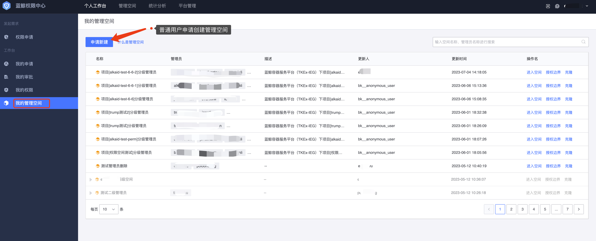
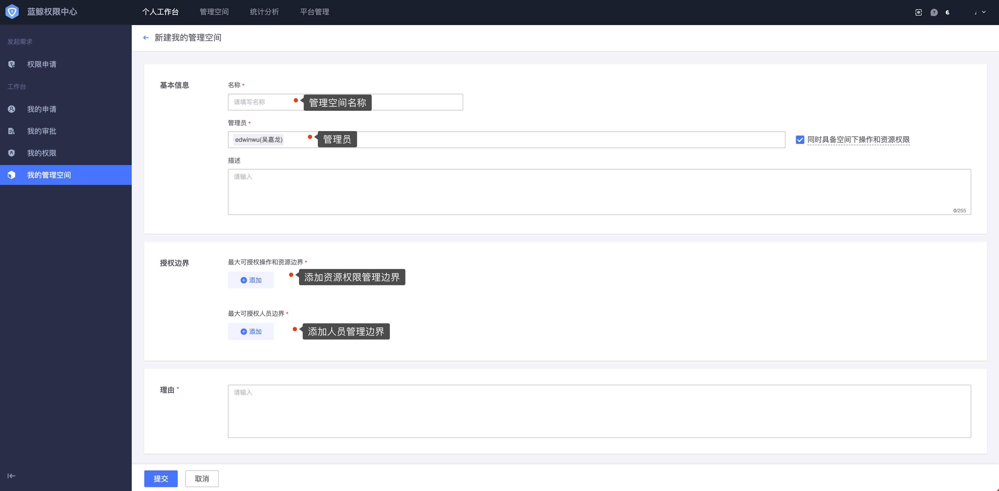
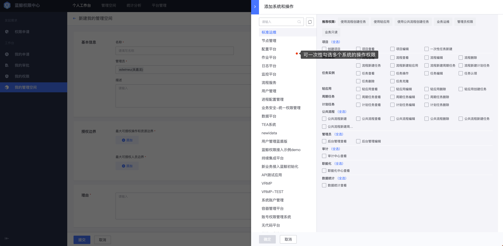
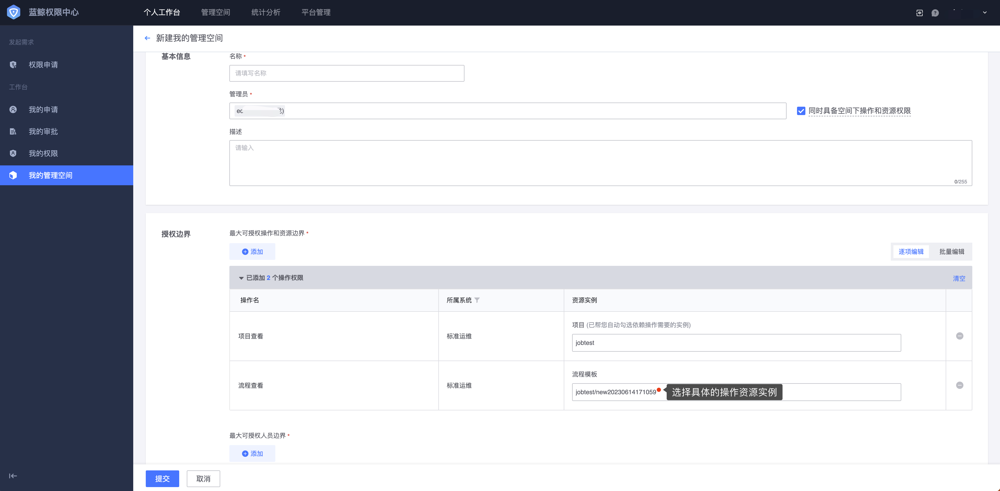
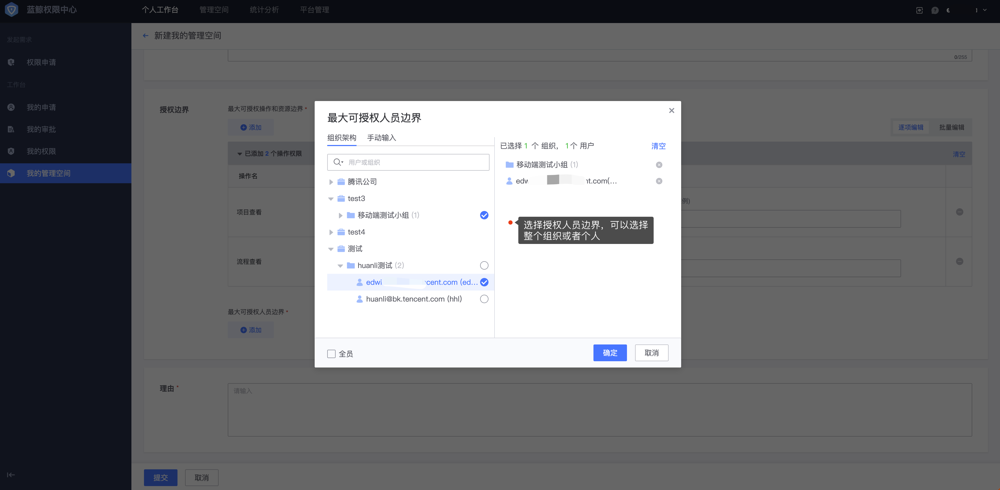

# 普通用户申请创建管理空间

用户登陆蓝鲸，打开权限中心，在**个人工作台-我的管理空间**菜单下，进入管理空间列表页，该页面展示个人的管理空间列表。

点击**申请新建**进行管理空间创建申请。

填写基本信息，选择管理资源权限和授权人员的**边界**。

## 基本信息

- 名称：区分不同管理空间，根据需求场景来命名，可以随时修改。
- 管理员：管理员默认只具备空间下的授权权限，不具备资源本身的操作权限，如需资源操作权限，可勾选右侧的**同时具备空间下操作和资源权限**。
- 描述：描述管理空间的职能。

## 最大可授权操作和资源边界

**最大可授权操作和资源边界**代表该管理空间的管辖**能够授权的最大权限范围**，可以跨系统选择多个操作。

选择操作后，需要针对每个操作进行对应的实例范围选择，实例选择可以选择具体实例，也可以通过属性条件来实现动态实例的选择。

> 比如，选择了 A 系统的 a 操作，对应的实例是 i1，i2，i3，则该分级管理员就只能给其他人授予 a 操作的 i1、i2、i3 这几个实例内的权限。

## 最大可授权人员边界

**最大可授权人员边界**代表该管理空间能够`授权`的最大人员范围，也只有在可授权人员范围内的用户才能看到对应管理空间所创建的用户组，双向的限制，避免了不必要的权限给用户带来的干扰，也避免敏感权限外泄，人员可以是组织，也可以是具体某个用户。

> 比如，选择了`组织：广东分公司、用户：user`，则该管理空间只能给这两类人授权，也只有他们才能看到对应管理空间创建的用户组，去申请加入。

选择完操作实例和人员范围，点击`提交`即完成管理空间的申请创建，申请创建管理空间需要审批，审批通过后，可以在我的管理空间列表查看。
