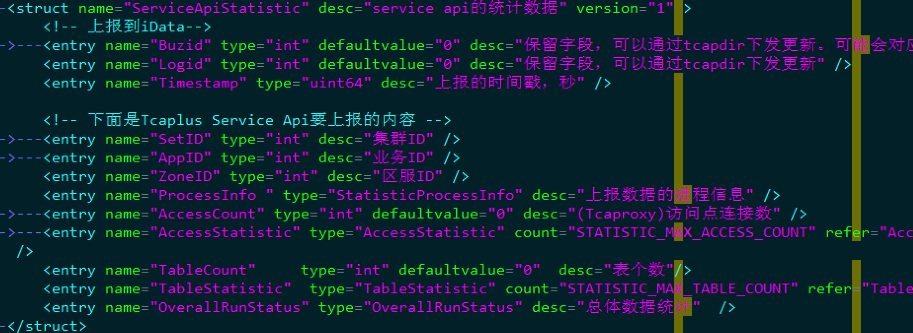
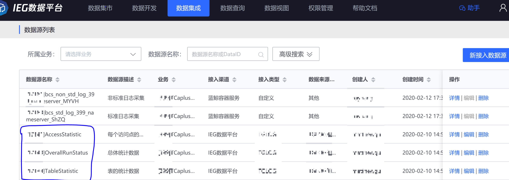
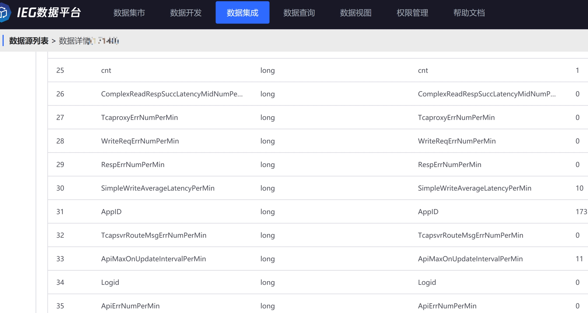
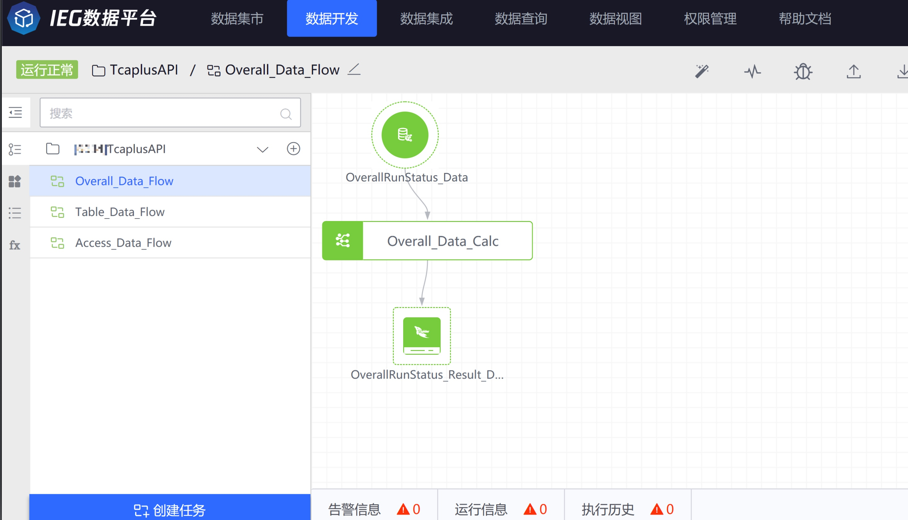
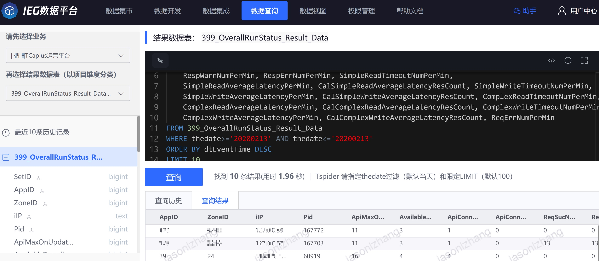
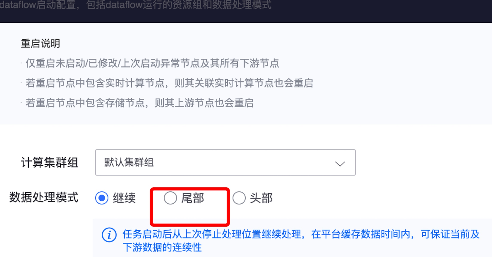
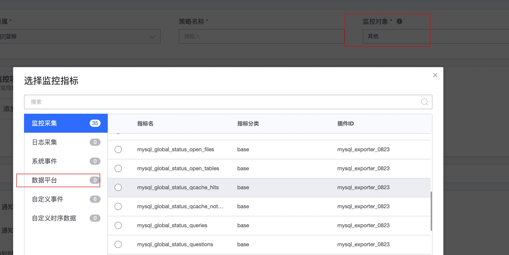
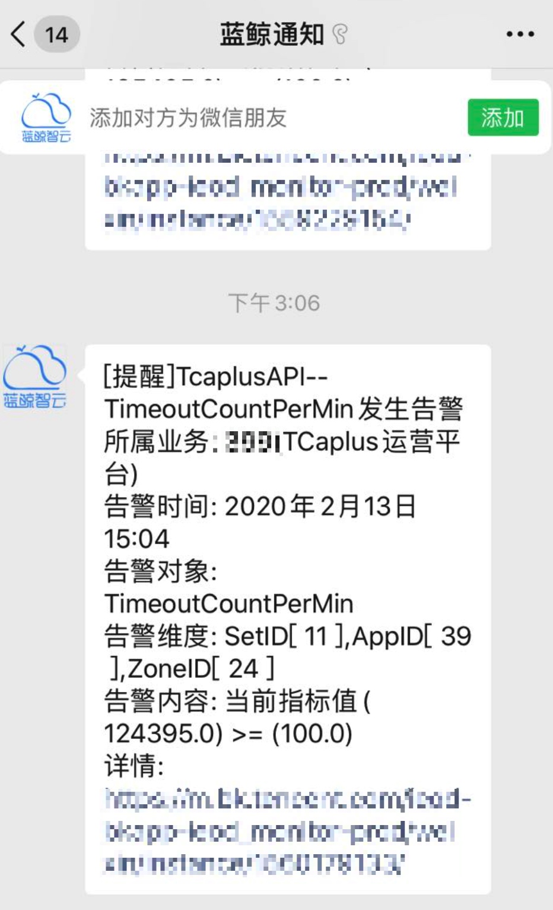

# 如何监控数据平台的数据

进入到数据平台的数据一般有如下情况：

1. 很多数据是监控无法直接采集和获取到
2. 原始的数据需要进行大量的数据计算
3. 一份数据有多种用途

在这种情况下又想增加监控的需求，监控平台平台就可以满足告警的需求。

## 前置步骤

**配置过程**：

1. 数据接入
2. 数据清洗
3. 数据入库
4. 数据计算
5. 告警配置
6. 监控仪表盘

> 说明：1-4 都是数据平台的功能，5-6 是属于监控平台的功能。本篇文档就是在说明两个平台之间的一些数据关系。

## 具体配置方法

以下具体配置方法介绍以`TcaplusAPI`统计指标为例。

### 需求背景

Tcaplus 是一个平台类服务，希望在 API 调用的代码里面添加运营数据统计，比如：指标为请求数，时延；维度是集群，业务，游戏区，表，机器，进程等

* Q：为什么不能通过日志或者采集插件主动采集上来？
    * 一个机器上的进程实例启动是动态变化的，如：游戏的开房
* Q：为什么一定要先入数据平台，而不是直接通过监控进行上报？
    * 因为一个业务采集的数据就有 150 个指标，但用于告警的只有 30 个，其他指标还有运营分析的需求。
    * 数据是海量数据，通过 TCP 进行上报保证海量数据的接入和存储。

以下是 Tcaplus 基于 xml 定义的结构化统计指标信息：



* 统计指标有三类：
	* OverallRunStatus 总体统计数据
	* AccessStatistic 各接入点统计数据
	* TableStatistic 表的统计数据

api 实例中每 **周期（1min）** 统计好各个指标的值，通过 TCP 上报给 iData。以下是 OverallRunStatus 上报的数据示例（AccessStatistic 跟 TableStatistic 类似，这里取小部分数据来例）：

```html
dataId=17140&tm=1581397544622&dt=1581397544013&
cnt=1&NodeIP=10.0.3.2&rt=1581397544391&
m=5&messageId=10.0.3.2#1912#1581397544354&bid=b_ieg_tcaplusapi|__tablename=OverallRunStatus&
Timestamp=1581397544&Buzid=0&Logid=0&
AppID=70&ZoneID=2&iIP=110.0.3.3&
CalComplexReadAverageLatencyResCount=234&SimpleWriteRespSuccLatencyHighNumPerMin=0&SimpleWriteRespSuccLatencyCustomizedNumPerMin=0&
SimpleWriteTimeoutNumPerMin=0&ReqSucNumPerMin=247&ApiFieldNotExistErrNumPerMin=0&
ComplexReadRespSuccLatencyLowNumPerMin=234&TcapsvrSystemErrNumPerMin=0&WriteRespWarnNumPerMin=0&
ApiConnectTcaproxyCount=4&WriteReqErrNumPerMin=0&ReadRespWarnNumPerMin=0&
```

* 指标：如 CalComplexReadAverageLatencyResCount  ApiConnectTcaproxyCount
* 维度信息包括用户自定义：SetID，AppID，ZoneID，ProcessInfo
* 维度信息包括默认自带：NodeIP，bid，iIP

### 数据接入

将原始的数据通过 TCP 上报到 iData 之后，先在数据平台创建业务 TcaplusAPI：


再在数据平台数据接入数据源(具体接入方法查看数据平台的白皮书)。TcaplusAPI 接入后的数据源：



### 数据清洗

接下来分别对 TcaplusAPI 的 3 个数据源上报的做数据清洗，数据清洗的目的是将原来文本的内容变成格式化的数据。例如： **OverallRunStatus** 数据清洗：


数据清洗的结果数据：



### 数据入库

然后分别对 TcaplusAPI 的 3 个数据源数据清洗的结果配置数据入库，例如：OverallRunStatus 的数据入库：

> 注意：当前监控只支持 MySQL 和 Tspider 的入库数据。Druid 还在适配中。


可以查看数据入库详情：


检查数据入库结果，看看是否成功入库了：


### 数据计算

要如何才可以被监控发现指标和维度呢?有两个办法：

第一：清洗表，简单的指标和维度辩识原则： 数据型为指标，字符串型为维度

> 注意：如果清洗表设置维度可以满足需求，就可以跳过数据计算环节。
> 清洗表如果数据有延迟并且需要汇聚就建立使用数据计算
> 数据索引：数据平台的是否有索引影响是查询效率 


第二：通过数据计算转换成结果表，默认 group by 的字段为维度 。

数据计算对于一些复杂的计算需求也可以通过数据计算来满足数据汇聚的一些需求。

TcaplusAPI 分别为 3 张原始数据表配置了数据计算任务，计算结果存入结果表，用于后面告警计算。




> 注意：在窗口示例往下有一个**统计频率** 默认 60 秒，就是数据计算的汇聚周期，该**统计频率**在监控里面的**监控周期**是对应的。

```SQL
select SetID, AppID, ZoneID, iIP, Pid,
  SUM(ApiMaxOnUpdateIntervalPerMin) as ApiMaxOnUpdateIntervalPerMin,
  SUM(AvailableTcapdirNum) as AvailableTcapdirNum,
  SUM(ApiConnectTcaproxyCount) as ApiConnectTcaproxyCount,
  SUM(ApiConnectTcaproxyErrNumPerMin) as ApiConnectTcaproxyErrNumPerMin,
  SUM(ReqSucNumPerMin) as ReqSucNumPerMin,
  SUM(RespSucNumPerMin) as RespSucNumPerMin,
  SUM(RespWarnNumPerMin) as RespWarnNumPerMin,
  SUM(RespErrNumPerMin) as RespErrNumPerMin,
 from 399_OverallRunStatus_Data
GROUP BY SetID, AppID, ZoneID, iIP, Pid
```

数据计算后：group by 的字段默认成为维度。如： `SetID, AppID, ZoneID, iIP, Pid` 会成为维度，其他的 `ApiMaxOnUpdateIntervalPerMin,AvailableTcapdirNum` 等这些是指标

> 注意：注意语法格式，同 MYSQL 的 SQL 一致。

检查数据计算的结果表有没有数据：



**注意事项**：

1. dataflow 的数据处理模式选择从**尾部**，可以快速的拿到最新的数据，一旦历史数据过多将很难产生最新的数据，这时当前配置的告警策略可能没有告警，视图没有图表。
2. 注意 SQL 语法格式。
3. 考虑`group by`维度的选择，像 Time 或者随机的 hash 值，无意义的自增 ID，都不适用于维度。维度是会在告警的通知里面显示的，所以选择有意义的维度是帮助快速定位和视图查看，如 区域，系统这类维度。
4. 不需要考虑原始数据中的时间字段，如上报添加的`TimeST`字段,在数据计算的时候是以`dtEventTime`进行周期汇聚和计算等。



### 告警配置

打开监控应用

在以下路径配置告警：导航  →  监控配置  →  策略  →  新建，先配置要告警的指标项：

* 监控对象：选择其他
* 添加监控指标，并在数据平台中选择对应的结果表数据和指标项



> 注意：监控识别指标维度是两种途径：
> 第一：清洗表设置维度，long 类型会出现在指标列表，其他出现在维度列表
> 第二：通过数据计算转换成结果表，默认 group by 的字段为维度

更多操作查看[策略配置功能介绍](../functions/conf/rules.md)

配置好告警策略，告警计算符合策略后会产生告警事件，更多查看[事件中心功能介绍](../functions/analyze/event.md)

产生告警消息：



### 监控的仪表盘视图

通过计算后的结果表数据在监控仪表盘也可以进行图表的展示。

更多查看[仪盘表功能介绍](../functions/report/new_dashboard.md)


