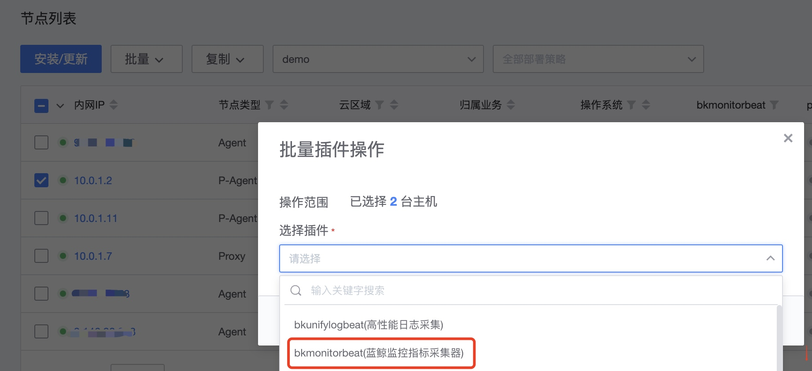
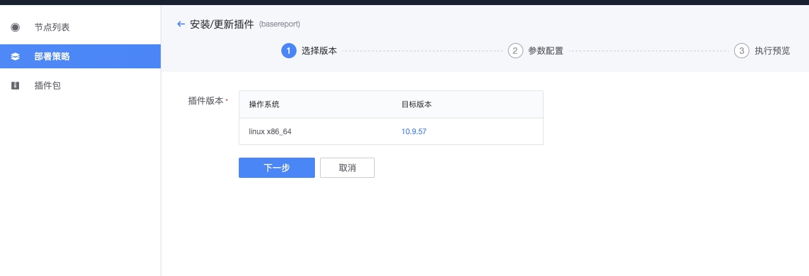
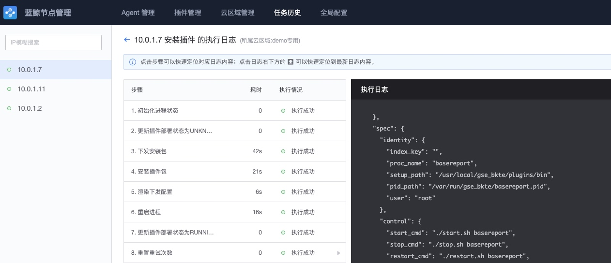

# 监控采集器安装 

## 名词

* gse_agent：是指蓝鲸平台提供的Agent
* 采集器：是采集数据的程序，通过gse_agent上报数据
* 采集器和gse_agent的关系
    
    gse_agent是数据上报的统一入口，监控采集器托管在gse_agent之上，当gse_agent启动后，被gse_agent托管的采集器会自动启动。如机器重启后，或者采集器被意外终止，只要gse_agent存活，则采集器都会被自动拉起。

## 插件功能

监控功能的数据采集依赖于采集器，部分插件为默认开启，部分为按需开启

功能	| 依赖插件| 	安装情况	| 操作方法 
---|---|---|---
基础管道	 | gse_agent | 接入CMDB的主机默认安装 | 如未安装或异常，见Agent安装指引
操作系统、进程、系统事件、日志关键字事件、拨测、k8s、自定义上报命令行	 |  bkmonitorbeat | 默认安装 |  默认安装，如无在节点管理安装
自定义字符型	| gsecmdline	| 默认安装，不推荐使用 功能都可以被自定义上报替代 | 	一般无需安装，要求2.0.2以上版本
跨云自定义上报(事件/指标)、ping服务| 	bkmonitorproxy	| 直连使用公共服务,云区域需要进行手动安装	| 在节点管理安装
日志文件采集	| bkunifylogbeat| 默认不安装 | 	在节点管理安装

注：可以支持的系统类型有Windows、Linux、AIX，系统架构x86,x86_64,arm32,arm64等

采集器默认安装的路径在/usr/local/ges/plugins/bin

## 安装采集器

 插件安装、托管，是通过节点管理进行统一操作的，打开节点管理

*  选择IP

    选择业务，操作系统类型，IP，然后点“下一步”

* 选择插件

    插件更新，选择所需要更新的插件，一般更新bkmonitorbeat即可，如需其他监控功能，安装/更新对应的插件，见本文首表格

* 更新插件
    
    更新插件是通过调用job API进行更新(gse_agent需处于正常状态)。

* 查看状态

    更新完毕后，执行状态会显示成功或失败

* 查看日志

    查看详细的插件更新日志，如图所示。

## 托管插件

插件托管是gse_agent对插件进行管理的一个功能，将控制gse_agent插件进程的启动，停止，自动拉起。其规则如下：

通过【节点管理】安装的gse_agent，以及通过【节点管理】安装的gse_agent插件，默认会被gse_agent托管(即gse_agent存活的情况下，会自动启动相关gse_agent插件)。

未通过节点管理安装的，如通过用户手动安装gse_agent(一般情况下不会出现)，bkmonitorbeat默认是不被托管的，在bkmonitorbeat被意外终止，或者机器重启，将不会自动启动bkmonitorbeat。托管bkmonitorbeat插件，可通过【节点管理】操作

选择业务，IP->批量插件操作

【(取消)托管】插件的操作路径如下：进程管理->托管(取消托管)->官方插件->插件名称->立即执行

## 采集器的资源使用率限制

采集器由gse_agent所托管，当资源超过配额限制，gse_agent会将采集器重启。

