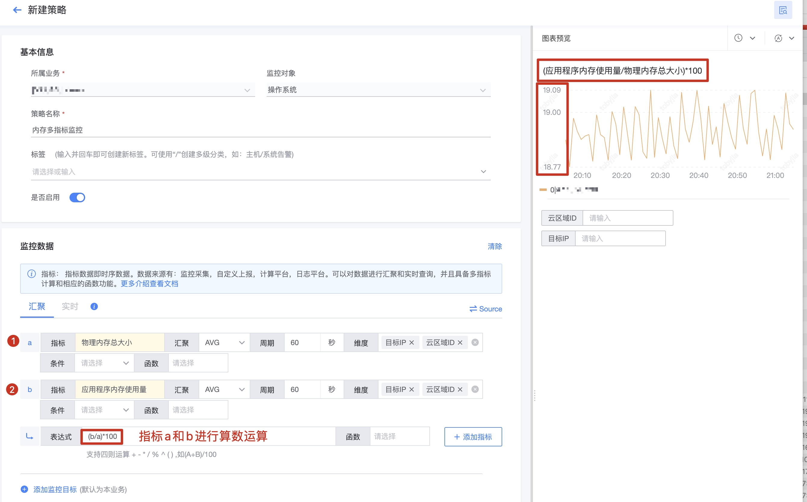

# 多指标计算及函数使用

适用的位置：

1. 仪表盘-指标数据源
2. 数据检索-指标检索
3. 配置-策略-指标

## 多指标计算

多指标计算指多个指标之间进行加减乘除等操作

注：可以进行指标计算的，数据周期和维度上需要一致

### PromQL

支持原生的PromQL语法 ， 可以直接切换成PromQL的模式

## 函数使用

### 指标变化函数

函数 |	功能描述
---|---
rate	| 每秒平均增长率, 周期内(last_val-first_val)/Interval，遇到下降则采用虚拟计数算法模拟增长，反映平均速率
increase | 增加量,周期内(last_val-first_val)，遇到下降则采用虚拟计数算法模拟增长值
delta	 | 差值,周期内(last_val-first_val)，允许结果为负数
irate	| 每秒平均增长率,周期内(last_val-pre_val)/Interval，遇到下降会从0开始计算，反映瞬时速率
idelta|差值,周期内(last_val-pre_val)，允许结果为负数
deriv	| 导数,使用简单的线性回归计算区间向量 v 中各个时间序列的导数 
changes | 	 数值变化次数,每个样本数据值变化的次数
resets	 | 计数器重置次数（单调增长指标，下降即为重置）

#### rate和irate的区别

时间 | 	值	| rate(2m)	| irate(2m)| 	irate(5m)	| 算法	| rate(5m)	算法 | 
---|---|---|---|---|---|---
22:33 | 1 | 0.167 | 0.167 | 0.167 | (2-1)/60 | 0.0183
22:34 | 2 | 0.167 | 0.167 | 0.167 | (3-2)/60 | 0.0167
22:35 | 3 | 0.167 | 0.167 | 0.167 | (4-3)/60 | 0.0167
22:36 | 4 | 0.167 | 0.167 | 0.167 | (5-4)/60 | 0.0417
22:37 | 5 | 0.167 | 0.167 | 0.167 | (6-5)/60 | 0.0958
22:38 | 6 | 0.167 | 0.167 | 0.167 | (7-6)/60 | 0.208
22:39 | 7 | 0.117 | 0.117 | 0.117 | (14-7)/60 | 0.438
22:40 | 14 | 0.233 | 0.233 | 0.233 | (28-14)/60 | 0.875
22:41 | 28 | 0.467 | 0.467 | 0.467 | (56-28)/60 | 1.75
22:42 | 56 | 0.933 | 0.933 | 0.933 | (112-56)/60 | 3.50
22:43 | 112 | 1.87 | 1.87 | 1.87 | (224-112)/60 | 7
22:44 | 224 | 3.73 | 3.73 | 3.73 | (448-224)/60 | 14
22:45 | 448 | 7.47 | 7.47 | 7.47 | (896-448)/60 | 12.7
22:46 | 896 | 14.9 | 14.9 | 14.9 | (1972-896)/60 | 11.8
22:47 | 1972 | 29.9 | 29.9 | 29.9 | (3584-1972)/60 | 9.76

### 数学计算函数

函数	| 功能描述
---|---
abs	|  绝对值，周期内指标值的绝对值，如|v1|,|v2|,|v3|
ceil	| 向上取整，向上四舍五入到最接近的整数，如1.7->2
floor	 |  向下取整，向下四舍五入到最接近的整数,如1.8->1
round	 | 四舍五入,函数与 ceil 和 floor 函数类似，返回所有样本值的最接近的整数
ln	 | 自然对数，log(10)=2.30,自然对数 e~=2.718281828
log2	|  以2为底的对数,如log2(4)=2 
log10	| 以10为底的对数，如log10(100)=2
sgn	| 所有的样本值，正数转为1，负数转为0，零则为0
sqrt	| 平方根，取正数，√100=10，√4=2 

### 仅仪表盘支持的函数

函数 |	功能描述
---|---
top | 基于图表查询的时间范围，按汇聚方法，找到TOP的N个值，再取出这N条线的数据
bottom	|基于图表查询的时间范围，按汇聚方法，找到bottom的N个值，再取出这N条线的数据
time_shift | 	基于当前图表的时间范围进行时间偏移

