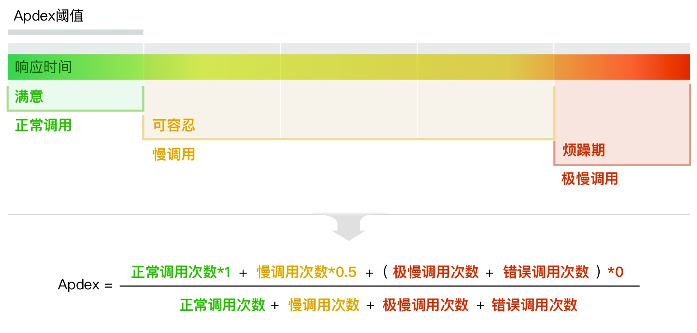

# APM 指标说明

### Apdex

Apdex（Application Performance Index）是由 Apdex 联盟开发的用于评估应用性能的工业标准。Apdex 标准从用户的角度出发，将对应用响应时间的表现，转为用户对于应用性能的可量化范围为 0-1 的满意度评价。

**Apdex 的原理**
Apdex 定义了应用响应时间的最优门槛为 T（即 Apdex 阈值，T 由性能评估人员根据预期性能要求确定），根据应用响应时间结合 T 定义了三种不同的性能表现：

| 性能表现                              | 说明                                      | 示例                                                         |
| ------------------------------------- | ----------------------------------------- | ------------------------------------------------------------ |
| Satisfied （满意）   | 应用响应时间低于或等于 T。                | 例如，T 为1.5s，则一个耗时1s的响应结果则可以认为是 Satisfied 的。 |
| Tolerating （可容忍）| 应用响应时间大于 T，但同时小于或等于 4T。 | 例如，应用设定的 T 值为1s，则4 × 1=4s为应用响应时间的容忍上限。 |
| Frustrated （烦躁期） | 应用响应时间大于 4T。                     | -                                                            |

### 错误率/数

错误率指应用、服务、接口等在某个统计周期内发生错误（包括模块本身的错误、主机错误、HTTP访问错误及网络错误等）的次数与总请求（或调用/访问）次数的比值。epm(Error Per Minute)表示每分钟错误数。

### 响应耗时

在单次接口事务中，从用户发出该接口的请求到该接口得到响应所用的时间。

### 调用次数

主调/被调

接口在服务的运行过程中的调用次数。

### 黄金指标

指标选择器中的指标

* 耗时 bk_apm_duration	
* 调用次数 bk_apm_count	
    * 统计方法：count
* 最大耗时 bk_apm_max_duration   
    * 统计方法：max
* 总耗时 bk_apm_sum_duration  
    * 统计方法：sum
* 错误数量 bk_apm_error_count 
    * 维度：span_name,service_name,kind,resource.bk.instance.id,attributes.peer.service,bk_app_name,bk_biz_id
    * 条件：kind == 2  status.code = 2  
    * 统计方法：count
* 慢查询数 bk_apm_frustrated_count 
    * 维度：span_name,service_name,kind,resource.bk.instance.id,attributes.peer.service,bk_app_name,bk_biz_id
    * 条件：apdex_type==frustrated
    * 统计方法：count 
* 正常查询数 bk_apm_satisfied_count 
    * 维度：span_name,service_name,kind,resource.bk.instance.id,attributes.peer.service,bk_app_name,bk_biz_id 
    * 条件：	apdex_type==satisfied 
    * 统计方法：count
* 可容忍查询数 bk_apm_tolerating_count
    * 维度：span_name,service_name,kind,resource.bk.instance.id,attributes.peer.service,bk_app_name,bk_biz_id 
    * 条件：apdex_type==tolerating
    * 统计方法：count 
* 被调数 bk_apm_call_count	 
    * 维度： span_name,service_name,kind,resource.bk.instance.id,attributes.peer.service,bk_app_name,bk_biz_id
    * 条件： kind == 2|4	
    * 统计方法：count
* 主调数 bk_apm_request_count 
    * 维度：span_name,service_name,kind,resource.bk.instance.id,attributes.peer.service,bk_app_name,bk_biz_id 
    * 条件 kind == 3|5	 
    * 统计方法：count 

