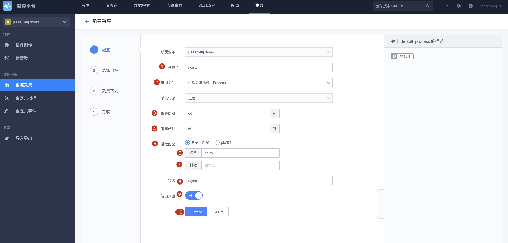
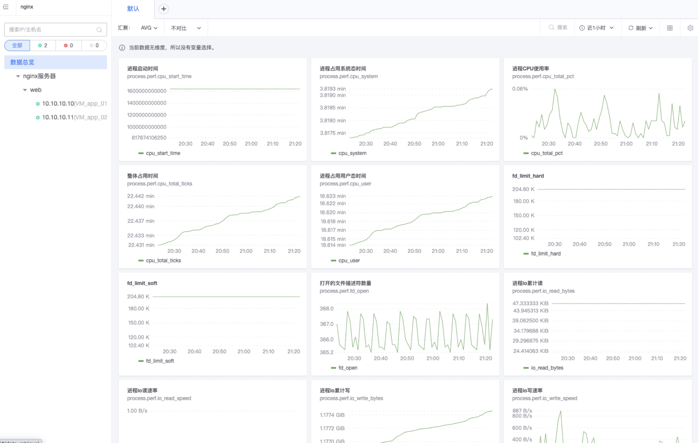

# 进程监控-进程采集插件

动态进程采集插件是平台内置的一个插件配置能力，依赖bkmonitorbeat，当采集任务配置好下发到目标机器后，会基于采集的任务信息进行工作。

适合于在CMDB中无法定义固定的进程名称匹配端口情况，比如端口是随时变化的，且无固定端口，故无法通过方式在CMDB中定义端口方式监控

## 实现原理 

通过配置需要监控的进程名，条件可以选择包含，不包含某些命令行的关键字，类似Linux命令

```
#注意，这里是表示该功能类似于如下Linux命令，实际的检测过程并不依赖Linux命令

ps -ef | grep "包含的关键字"|grep -v "不包含的关键字"
```
过滤出需要的进程，然后探测该进程是否开启端口(可选功能)，同时会采集该进程的相关使用情况


## 如何配置采集

前提依赖安装bkmonitorbeat采集器，在"节点管理"确认是否已经安装。 


菜单：集成->数据采集->新建


填写采集相关数据



* 所属业务：默认选择，无需配置
* 名称：采集项的名称，表示该数据采集的用途
* 采集对象：选择进程
* 采集周期：默认为1min，可按需配置
* 采集方式：Process
* 选择插件：选择采集方式后，默认会选中进程采集插件，无需配置
* 进程匹配：分为命令行匹配和pid文件2种方式


命令行匹配方式

```
包含：进程匹配字符串，一般是进程的名称，注意Linux是cmdline, windows是匹配进程名

 不包含：即不上报的进程，可以填写正则表达式，如(\d+)，不采集匹配数字的进程，^
```

进程名：进程的名称，可以填写进程的实际名称，也可以填写正则，正则的括号表示最终取值的内容。如`(/containers/\d+)`，如其cmdline为

```
/bin/java -Xms30720m -Xmx30720m -XX:+UseConcMarkSweepGC -XX:CMSInitiatingOccupancyFraction=75 -XX:+UseCMSInitiatingOccupancyOnly -XX:+DisableExplicitGC -XX:+AlwaysPreTouch -server -Djava.awt.headless=true -Dfile.encoding=UTF-8 -Djna.nosys=true -Dio.netty.noUnsafe=true -Dio.netty.noKeySetOptimization=true -Dlog4j.shutdownHookEnabled=false -Dlog4j2.disable.jmx=true -Dlog4j.skipJansi=true -XX:+HeapDumpOnOutOfMemoryError -Des.path.home=/data1/containers/1495608881000003411/es -cp /data1/containers/1495608881000003411/es/lib/* org.elasticsearch.bootstrap.Elasticsearch -d
```

则最终上报的进程名是/containers/1495608881000003411

## 上报后的效果




指标说明相关查看[进程指标说明](./process_metrics.md)


 

