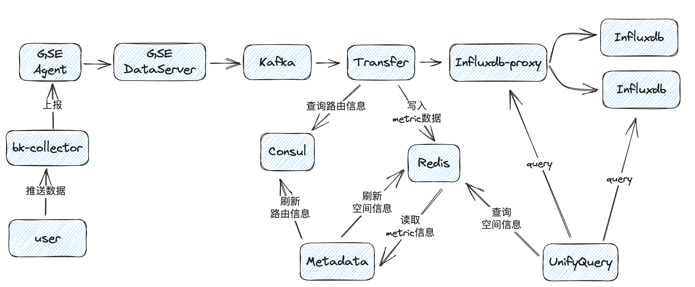
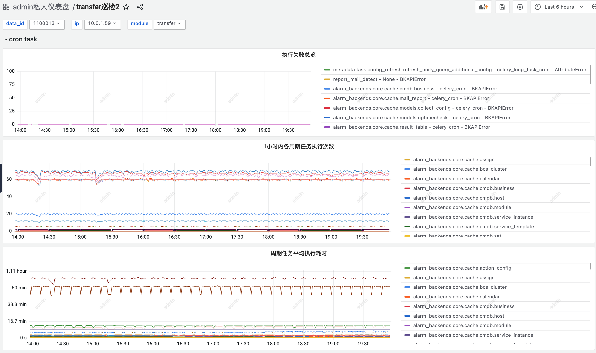
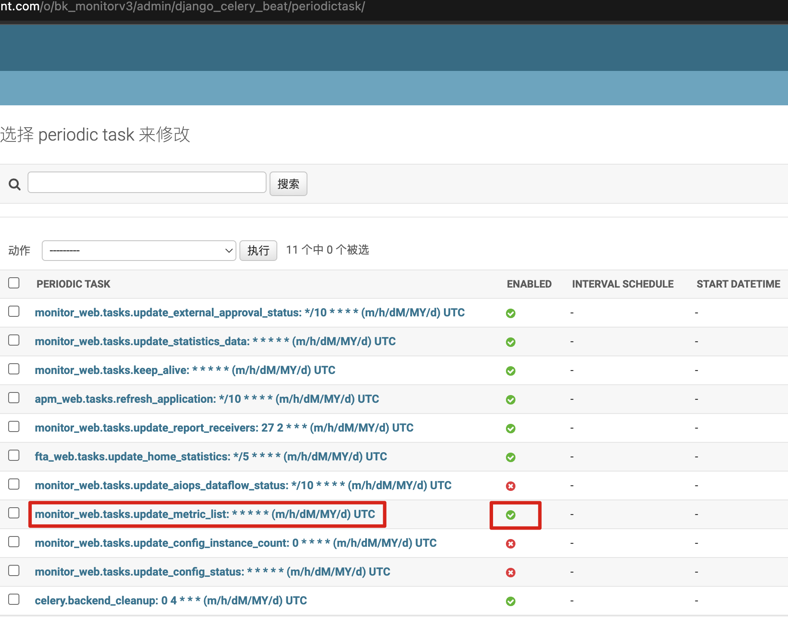

# 自定义指标数据不显示排查文档

## 适用范围

本文档适用于在上报自定义指标数据后，以下情形的问题排查：

- 自定义指标采集详情页面时序列表中无数据更新

- 自定义指标采集可视化页面无数据

注：以下命令、路径适用于蓝鲸 v6 环境；
容器化部署环境的命令请根据实际路径修改；

## 数据流



## Metadata

### 自定义指标不显示可能的原因

1. consul 中路由信息异常，导致 transfer 无法正常消费、处理和转存数据
2. redis 中空间信息异常，导致 unify-query 无法正确查询数据
3. 自定义时序指标维度信息同步任务执行异常，指标、维度及 redis 中空间信息未正常更新
4. SaaS 层指标缓存信息更新异常

### 准备

1. 在排查前建议先配置**排查仪表盘**，也可以临时通过数据探索-指标检索来查看对应指标；
2. 配置 metadata 日志采集；

​			配置操作文档：[问题排查前置操作.md](./troubleshootingPreSteps.md)

### 排查

1. 查看仪表盘，过滤指定的 data_id ，观察以下指标：

   - 前端消费数、后端写入数

     在有数据上报的情况下，若这两个指标在**增加**，则表示 transfer 正常消费 kafka 中数据并写⼊ influxdb 中，通常可认为 consul 中路由信息正常，需对 **unify-query 模块**和 **Redis 中空间信息**部分进⼀步排查；

     若这两个指标一直不变，则表示数据未被 **transfer** 处理，需要对 **transfer 模块**和 **consul 中路由信息**进⼀步排查；

     

2. consul 中路由信息、redis 中空间信息和自定义时序指标维度的同步及更新主要由下列监控后台 celery 定时任务负责：

   ```shell
   # consul中路由信息同步
   metadata.task.config_refresh.refresh_datasource # 刷新数据源信息到 consul celery_long_task_cron
   metadata.task.config_refresh.refresh_influxdb_route # 刷新结果表路由配置 celery_long_task_cron
   # redis中空间信息同步
   metadata.task.sync_space.sync_bkcc_space # celery_long_task_cron
   metadata.task.sync_space.sync_bcs_space # celery_long_task_cron
   metadata.task.sync_space.refresh_bcs_project_biz # celery_long_task_cron
   # ⾃定义时序指标维度更新
   metadata.task.custom_report.check_update_ts_metric # celery_cron
   ```

3. 在仪表盘中检查上述任务的执行情况，观察以下指标：

   - 执行失败总览

     若该指标呈现增加趋势，表示对应的定时任务有执行失败，请检查监控后台服务器资源情况，并根据任务依照**处理**章节中**任务执行失败**的指引进一步排查对应任务的日志；

   - 一小时内各周期任务执行次数

     对应任务每小时内执行次数应该相对稳定，若突然变小甚至为 0，表明任务未按计划执行，会导致 **consul 路由信息**、**redis 中空间信息**同步延迟，以及**⾃定义时序指标维度更新**延迟，请依照**处理**章节中**任务同步延迟**的指引进一步排查；

     

4. 若采集详情页面时序列表中指标、维度信息未更新或无数据：

   首先在 redis 中检查 transfer 推送的指标、维度信息是否正确：

   ```shell
   redis-cli -h {redis_host} -p {redis_port} -a {redis_pwd}
   # 查询指标信息
   # ZREVRANGEBYSCORE bkmonitor:metrics_{bk_data_id} +inf -inf WITHSCORES LIMIT 0 100
   ZREVRANGEBYSCORE bkmonitor:metrics_1574649 +inf -inf WITHSCORES LIMIT 0 100
   # 返回的是指标名，检查是否包含推送的指标
   1) "memory_load"
   2) "1691661015"
    
   # 维度信息
   # hget bkmonitor:metric_dimensions_{bk_data_id} {metric_name}
   hget bkmonitor:metric_dimensions_1574649 memory_load
   # 检查维度信息是否缺失
   "{\"dimensions\":{\"module\":{\"last_update_time\":1691661015,\"values\":null},\"location\":{\"last_update_time\":1691661015,\"values\":null},\"target\":{\"last_update_time\":1691661015,\"values\":null}}}"
   ```

   若指标、维度信息查询不到或与预期不符，表示 transfer 未正常写入数据，请排查 **transfer 模块**；

   若指标和维度信息正常，请在 Redis 中查询对应空间数据，检查是否符合预期（field、filters、measurement_type）

   ```shell
   redis-cli -h {redis_host} -p {redis_port} -a {redis_pwd}
   # hget bkmonitorv3:spaces:{space_uid} {table_id}
   # space_uid = {空间类型}__{空间ID} 可以从接口获取{paas_url}/o/bk_monitorv3/rest/v2/commons/list_spaces/
   hget bkmonitorv3:spaces:bkcc__2 2_bkmonitor_time_series_1574649.__default__
   "{\"type\":\"bkcc\",\"field\":
   [\"memory_load\"],\"measurement_type\":\"bk_split_measurement\",\"bk_data_id\":\"15
   74649\",\"filters\":[],\"segmented_enable\":false}
   ```

   若对应 Key 中查不到数据或与预期不符合，请检查同步**⾃定义时序指标维度更新任务**执行情况；

5. 在确认了 consul 路由信息、Redis 空间信息、同步任务执行情况都正常的情况下，若还无数据显示，需要关注 SaaS 层的指标缓存是否正常，请依照**处理**章节中 **SaaS 层指标缓存信息更新异常**的指引进一步排查；

### 处理

1. 任务执行失败

   任务执行失败需要先从日志中检索出错误信息，再根据错误信息进行下一步排查

   根据不同任务可以检索对应的一些关键字：

   ```shell
   # 在⽇志平台或对应后台服务器上检索以下关键字或任务名进⾏排查
   # refresh_datasource
   "failed to refresh outer config for"
   
   # refresh_influxdb_route
   "failed to refresh influxdb router info for"
   "failed to sync database for"
   "refresh tag failed for"
   
   # sync_bkcc_space
   "push bkcc type space"
   # sync_bkcc_space/sync_bcs_space/refresh_bcs_project_biz
   "push redis data, space"
   
   # check_update_ts_metric
   "check_update_ts_metric"
   "try to update ts metrics from redis failed"
   ```

   根据错误信息进行下一步排查或提供给开发排查

2. 任务同步延迟

   检查 RabbitMQ 对应队列是否存在任务堆积（队列 celery_long_task_cron/celery_cron） ：

   ```shell
   # 进入MQ服务器
   ssh $BK_RABBITMQ_IP
   # 查看任务队列
   rabbitmqctl list_queues --vhost bk_bkmonitorv3 | grep celery_long_task_cron
   celery_long_task_cron 0
   
   rabbitmqctl list_queues --vhost bk_bkmonitorv3 | grep celery_cron
   celery_cron 100
   ```

   若队列存在堆积，可能是 celery worker 假死导致，可尝试重启 celery worker 再观察队列消费情况：

   ```shell
   # 从中控机进⼊监控后台
   ssh $BK_MONITORV3_IP
   # 重启阻塞的 celery worker
   /opt/py36/bin/python3.6 /opt/py36/bin/supervisorctl -c /data/bkee/etc/supervisor-bkmonitorv3-monitor.conf restart scheduler:celery_worker_cron
   
   /opt/py36/bin/python3.6 /opt/py36/bin/supervisorctl -c /data/bkee/etc/supervisor-bkmonitorv3-monitor.conf restart scheduler:celery_worker_long_task_cron
   ```

   必要时可以通过以下命令手动进行同步异常的任务的执行：

   ```shell
   # 从中控机进⼊监控后台
   ssh $BK_MONITORV3_IP
   # 切换 python 环境
   workon bkmonitorv3-monitor
   
   # 执⾏django command
   # 1. consul 中路由信息同步
   ./bin/manage.sh refresh_influxdb_proxy_config
   
   # 2. redis 中空间信息同步
   ./bin/manage.sh init_redis_data --forece
   
   # 3. 同步⾃定义时序维度信息
   ./bin/manage.sh refresh_ts_metric --data_id {data_id}
   ```

3. SaaS 层指标缓存信息更新异常

   - 检查周期任务是否开启
     页面跳转到：${监控域名}/admin/django_celery_beat/periodictask/

     检查任务：monitor_web.tasks.update_metric_list

     

   - 检查周期任务是否开启

     检查 saas 对应的 RabbitMQ 队列是否堵塞

     ```shell
     # 进入 MQ 服务器
     ssh $BK_RABBITMQ_IP
     # 查看任务队列
     rabbitmqctl list_queues --vhost prod_bk_monitorv3 | grep celery_resource
     celery_resource	0
     ```

     若队列存在堆积，可尝试重启 celery worker 或清除队列：

     ```shell
     # 登录监控 saas 部署的 APPO 服务器并进入容器中
     docker ps | grep bk_monitorv3
     7058931d157c		python36e:1.0		"sh /build/builder"		2 days ago		Up 19 hours		bk_monitorv3-1692072932
     
     # docker exec -it {container_id} bash
     docker exec -it 7058931d157c bash
     # restart worker
     /cache/.bk/env/bin/python3 /cache/.bk/env/bin/supervisorctl -c /data/app/conf/supervisord.conf restart bk_monitorv3_celery_resource
     ```
