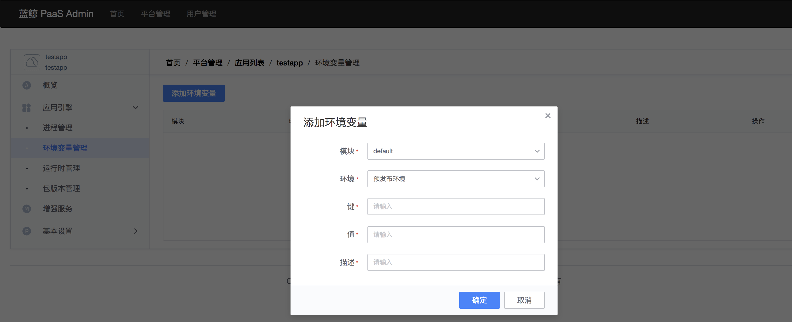

# 系统维护

PaaS3.0 平台提供了基础的维护方式，让管理员可以基于 WEB 页面进行简单的维护操作。

访问地址：{PaaS3.0开发者中心访问地址}/backend/admin42/

说明：
1. 初始仅 `admin` 账号可访问管理后台
2. 必须先打开并登录到 PaaS3.0 开发者中心后，才能正常打开访问后台管理后台。


若接入了自定义登录后没有 `admin` 账号，可以进入 `bkpaas3-apiserver-web` pod 执行如下命令添加其他管理员账号：

```
from bkpaas_auth.core.constants import ProviderType
from bkpaas_auth.models import user_id_encoder
from paasng.infras.accounts.models import UserProfile

username="your_name"
user_id = user_id_encoder.encode(ProviderType.BK.value, username)
UserProfile.objects.update_or_create(user=user_id, defaults={'role':4, 'enable_regions':'default'})
```

### 用户列表

在这里添加可以访问管理后台的用户

注意：用户类型为: BK，用户角色为：超级用户


### 应用集群管理

这里可以修改应用集群配置，并添加新的应用集群，配置修改后重新部署应用即可生效

详细的参数说明，请参考[初始化集群配置 ](../../../../Operation/PaaS3/docs/configure_initial_cluster.md)


### 应用资源管理

开发者可以在「部署管理」-「进程详情」中查看应用进程的资源配置上限。


如果需要调整应用进程的资源配置上限可以在管理后台「平台管理」-「应用列表」中筛选出具体的应用，进入到应用的 「应用引擎」-「进程管理」页面，点击对应进程的 “修改资源方案” 后，可以：
1. 选中一个已有的资源方案
2. 新建一个新的资源方案


### 应用环境变量管理

开发者可以在「模块配置」-「环境变量」中添加和修改环境变量，但是无法添加以 `BK_`、`BKPAAS_` 等为前缀的环境变量。
如有特殊情况需要添加这类环境变量的可以由管理员在管理后台「平台管理」-「应用列表」中筛选出具体的应用，进入到应用的 「应用引擎」-「环境变量管理」页面操作。




管理后台还包含了运行时管理、增强服务管理等功能，并能在应用列表页面查看所有应用的信息。
