# 基础套餐快速入门

> 如还未部署蓝鲸【基础套餐】，请参考[基础套餐部署指引](https://bk.tencent.com/docs/markdown/部署指南/产品白皮书/基础包安装/多机部署/quick_install.md)

## 一分钟感性认识7.0

- 登录界面

  全新的登录界面，支持中英文切换。

  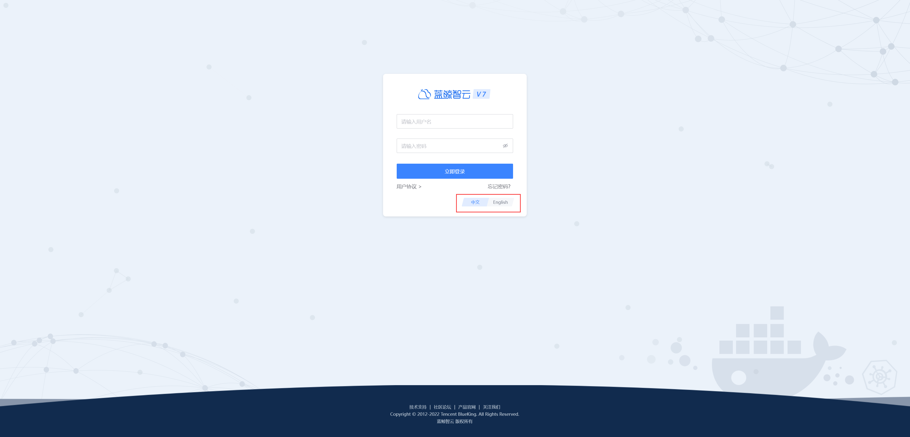

  

- 应用桌面

  以应用的方式展示部署之后的所有产品（包括后续自己开发的 SaaS），可以通过拖动图标排序来自定义 SaaS 位置。

  

- 个人中心

  可以在个人中心修改密码等信息及选择语言

  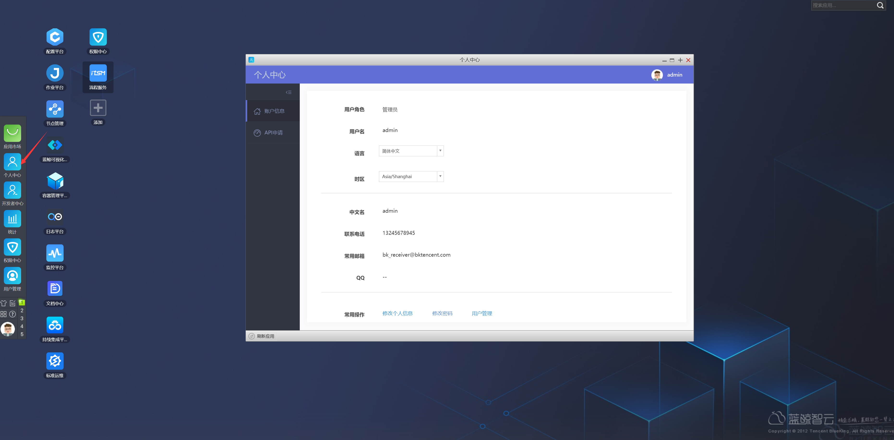

- PaaS 3.0 开发者中心

  全新的PaaS 3.0，面向开发人员，提供了丰富的“SaaS 开发者服务”，如前后台开发框架、API 网关(ESB)、调度引擎、公共组件等，让开发者可以简单、快速地创建、部署和管理 SaaS。

  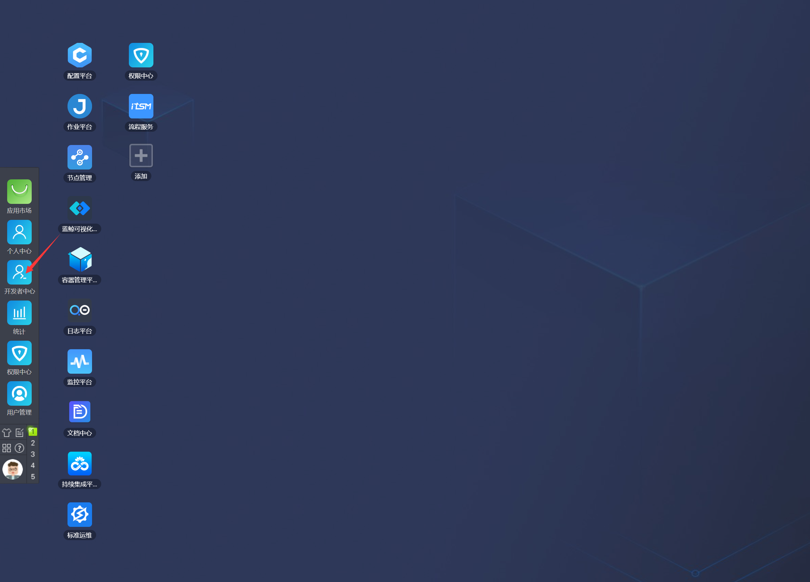

  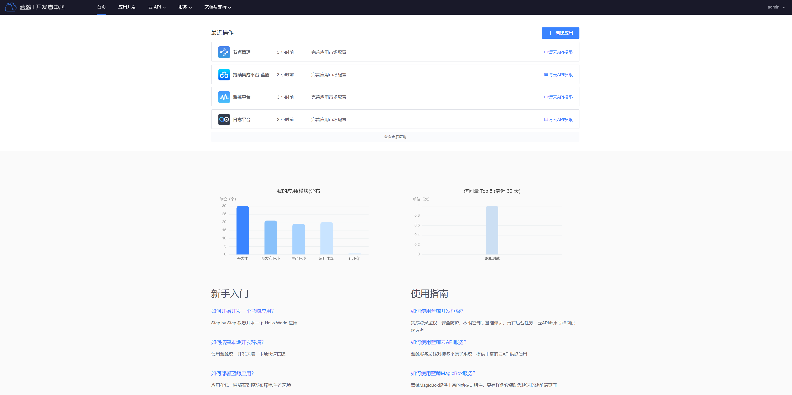

  

- 应用市场

  可以再应用市场搜索添加官方标准SaaS以及用户自定义开发的SaaS或外链应用到桌面。

  
  
  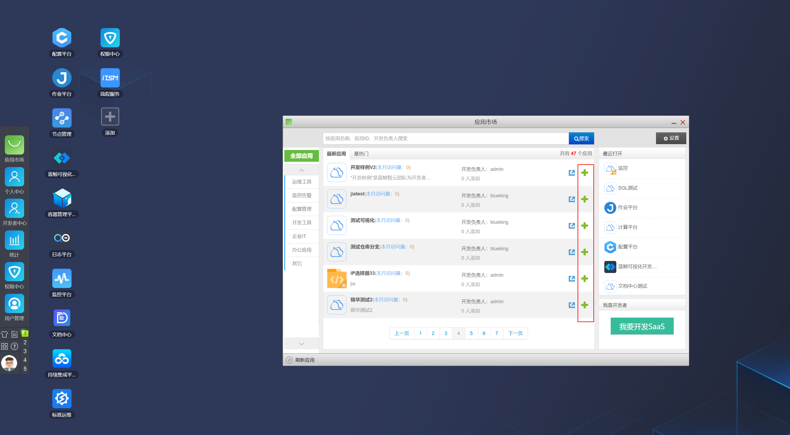

接下来，我们从`管理员`admin 视角来开启使用！

### 一、【用户管理】账号分配

> 蓝鲸部署完成之后只有一个系统默认内置的 admin 账号，也即管理员账号，拥有蓝鲸体系所有产品的权限。

如果需要不同角色人员来使用蓝鲸体系产品，则到【用户管理】添加用户即可。详见：[用户管理产品白皮书：新增本地用户目录](https://bk.tencent.com/docs/markdown/用户管理/产品白皮书/快速入门/AddLocalDirectory.md)

Ps：如果要在蓝鲸自带的用户鉴权体系上扩展，可以接入第三方的组织架构以及鉴权体系，详情可以参考：[蓝鲸登录接入企业内部登录](https://bk.tencent.com/docs/markdown/开发指南/扩展开发/对接企业登录体系/login_with_usermgr.md)

### 二、【配置平台】创建业务

> 配置平台是构建其他所有流程的基石，所以在配置平台创建业务是重要的前置步骤。

#### 1、创建业务

*`业务`是蓝鲸 CD 体系中比较重要的概念和维度，日常使用中主机、进程、业务拓扑的管理都需要依赖已经存在业务，其他蓝鲸体系产品也基本上都是围绕`业务`的维度来提供对应的服务和相关的鉴权。*

打开【蓝鲸配置平台】，选择`资源`-->`业务`-->`新建`

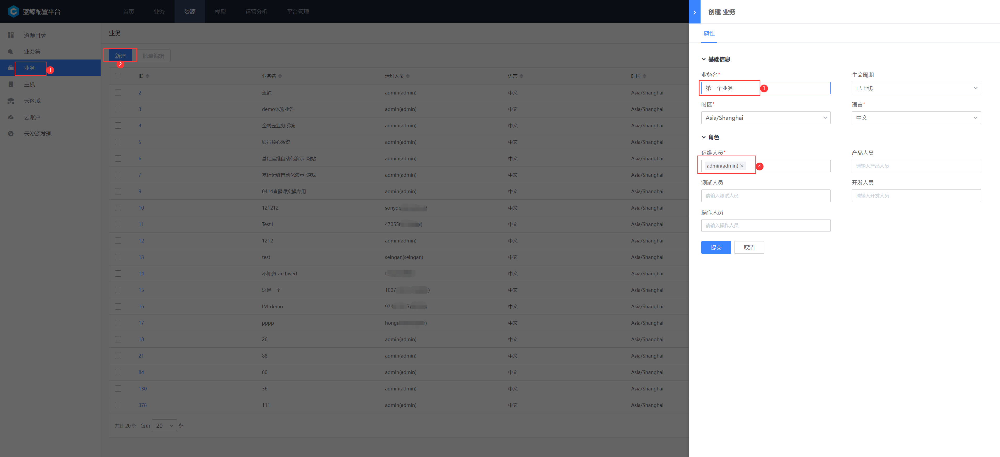

如果有跨多业务管控的场景需求，也可以选择创建业务集。

#### 2、创建业务拓扑

*`业务拓扑`是配置平台进行主机管理的基础，合适的业务模型，可以结构化的管理好主机。*

业务创建成功后在`业务`菜单中，可以看到下拉列表有了刚刚新增的业务，默认有一个`空闲机池`的 set 和三个模块，如下：

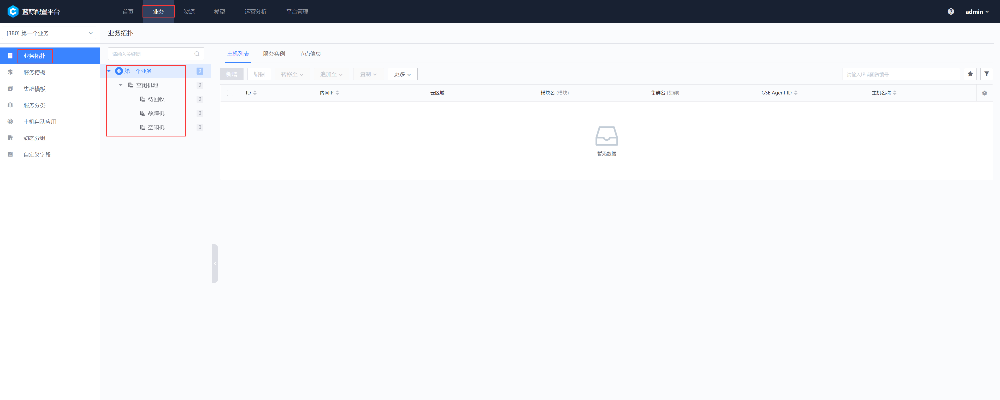

点击拓扑顶点的业务，新建集群

有两种方式创建集群，这里以直接创建为例（同下面创建模块），从集群模板创建详见：[集群模板](https://bk.tencent.com/docs/markdown/配置平台/产品白皮书/产品功能/SetTemp.md)

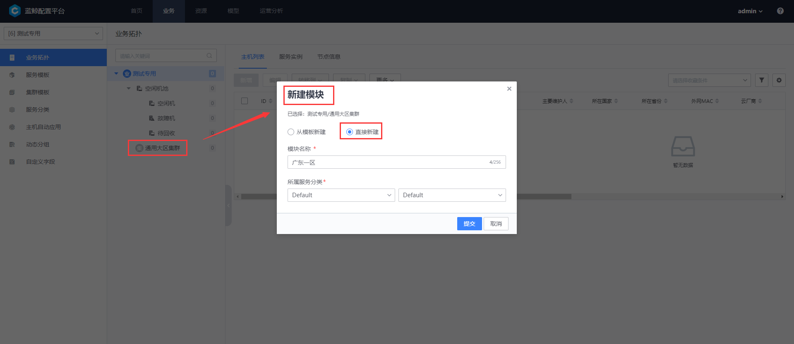

从模板新建模块和服务分类的详细说明，可详见：[服务模板](https://bk.tencent.com/docs/markdown/配置平台/产品白皮书/产品功能/ServiceTemp.md)  [服务分类](https://bk.tencent.com/docs/markdown/配置平台/产品白皮书/产品功能/ServiceType.md)

至此，业务拓扑即创建完毕。

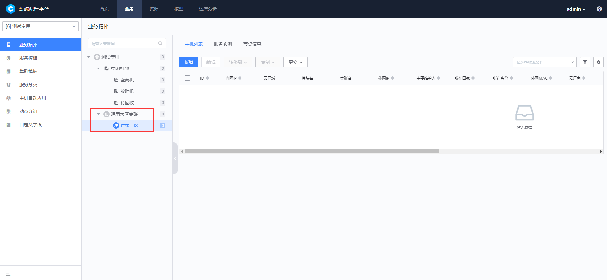

*Ps:业务拓扑默认三层，业务-->集群-->模块；如果实际应用场景不满足，可以新增自定义层级（最多支持 7 层），详见：[模型关系](https://bk.tencent.com/docs/markdown/配置平台/产品白皮书/产品功能/ModelRelation.md)*

#### 3、导入主机

> 主机是配置平台管控最常见的资源，也是运维日常主要的管控对象；更多 CMDB 配置模型管理见：[模型管理](https://bk.tencent.com/docs/markdown/配置平台/产品白皮书/产品功能/Model.md)

（1）方式一：手动导入，`资源`-->`主机`-->`导入主机`，批量从 Excel 导入（注意：批量导入只能导入直连区的主机，跨云区域的需要通过 Agent 安装导入，云区域说明详见：[基本概念：云区域](https://bk.tencent.com/docs/markdown/节点管理/产品白皮书/Introduce/Terms.md)）

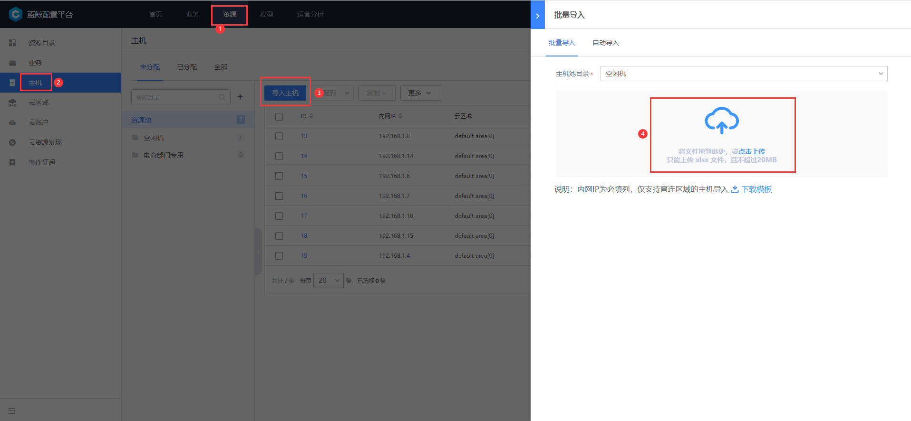

（2）方式三：云资源同步（目前暂只支持腾讯云和亚马逊云）

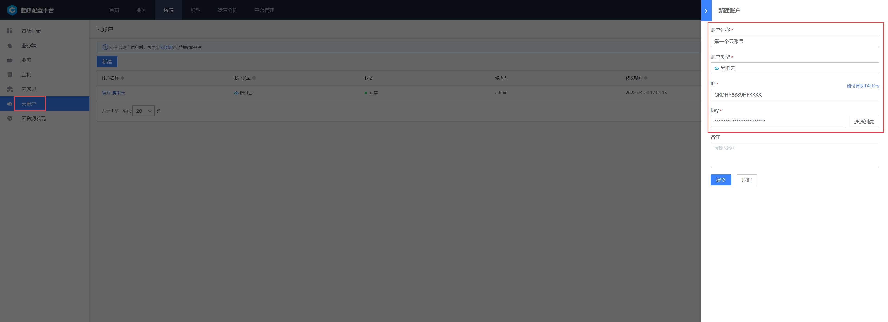

（3）方式三：安装 Agent 自动注册到CMDB（推荐）

### 三、【节点管理】Agent 安装

> 蓝鲸 Agent，是实现主机与蓝鲸通讯的专用程序，在主机上安装了蓝鲸 Agent 以后，可以通过蓝鲸对主机进行管控，包含文件分发、作业执行、数据上报、基础信息采集等，是所有上层服务的基础。

安装工具：**[节点管理](https://bk.tencent.com/docs/markdown/节点管理/产品白皮书/Introduce/Overview.md)**（批量快速地部署蓝鲸 Agent，覆盖 Linux、Windows）

以安装直连区域为例（非直连安装可详见：[安装蓝鲸 Agent（自定义云区域）](https://bk.tencent.com/docs/markdown/节点管理/产品白皮书/QuickStart/CustomCloudAreaInstallAgent.md)）

打开【节点管理】，选择`Agent管理`菜单，点击安装 Agent-->普通安装

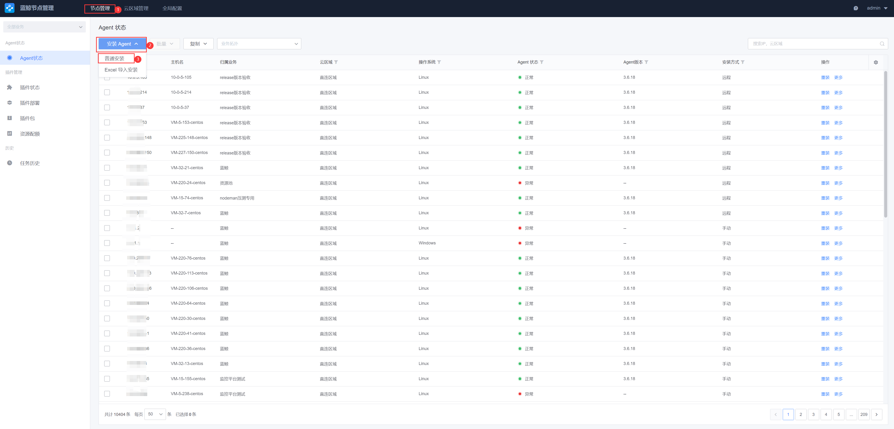

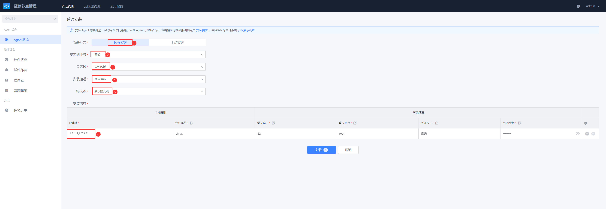

安装过程可以看到每个步骤的详情

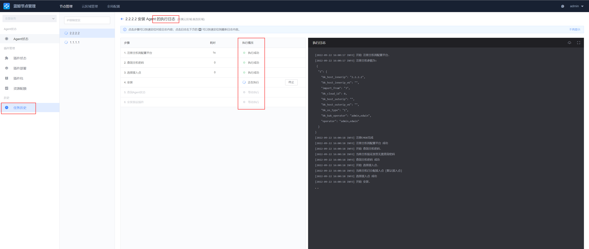

安装成功后，在`Agent管理`菜单可以看到状态正常，即完成 Agent 的安装

### 四、【作业平台】作业执行&文件分发

> Agent 安装完之后，即可用[作业平台](https://bk.tencent.com/docs/markdown/作业平台/产品白皮书/Introduction/What-is-Job.md)进行批量脚本执行、文件分发、文件拉取、定时任务等基础运维操作

#### 1、快速脚本执行

打开[作业平台](https://bk.tencent.com/docs/markdown/作业平台/产品白皮书/Introduction/What-is-Job.md)，选择左边菜单栏的`脚本执行`

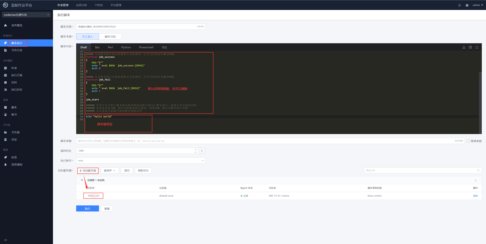

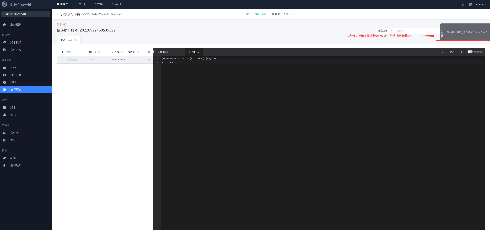

#### 2、快速文件分发

打开[作业平台](https://bk.tencent.com/docs/markdown/作业平台/产品白皮书/Introduction/What-is-Job.md)，选择左边菜单栏的`文件分发`

至此，我们完成了作业平台的两大核心功能`脚本执行`和`文件分发`的操作；通常情况，我们往往是需要组合这两个操作原子，并进行编排，比如版本包分发到服务器之后，需要解压，然后需要修改配置并拉起进程，这种场景我们可以通过作业平台的`作业`功能来实现，可详见：[作业管理](https://bk.tencent.com/docs/markdown/作业平台/产品白皮书/Features/Jobs.md) 。

### 五、【标准运维】任务流程编排

> **标准运维**是通过可视化的图形界面进行多系统间的“任务流程编排”和“执行”的系统，将企业内部多系统间的工作整合到一个流程模版中，实现一键自动化调度。

标准运维使用`项目流程`作为任务编排模板，通过`项目流程`模板可以反复新建、执行“任务”实例，从而实现“反复多次一键自动化调度”运维日常任务的功能。

我们准备编排一个简单的流程：**去服务器 IP1 上执行脚本（基于蓝鲸作业平台），然后发邮件通知（基于蓝鲸 PaaS 平台）告诉用户 userA：脚本执行完成**；并能够反复多次一键自动化调度使用。

#### 1、创建项目流程

标准运维使用`项目流程`进行调度编排。进入标准运维后，选择`流程`-`项目流程`(公共流程的使用场景可以见白皮书)，选择服务器 IP1 所在的业务。

在项目流程页面，点击左上角新建按钮，新建项目流程。

#### 2、编排项目流程

流程编排页面的总体界面介绍：

**上方：标题和流程功能区。** 命名标题和编辑流程的 4 项功能：设置全局变量、基础信息、本地快照、模板数据。

**左侧：插件节点。** 选择已经对接的系统功能插件、和流程逻辑按钮。

**中间：画布。** 将左侧原子、流程逻辑按钮，拖拽到画布上，连接，进行任务编排。

（1）拖拽左侧节点`作业平台(job)—快速执行作业`和`蓝鲸服务(BK)—发送通知`插件，到中间画布区域。

（2）通过连线，将节点以`开始`-->`快速执行作业`-->`发送通知`-->`结束`的方式进行编排。

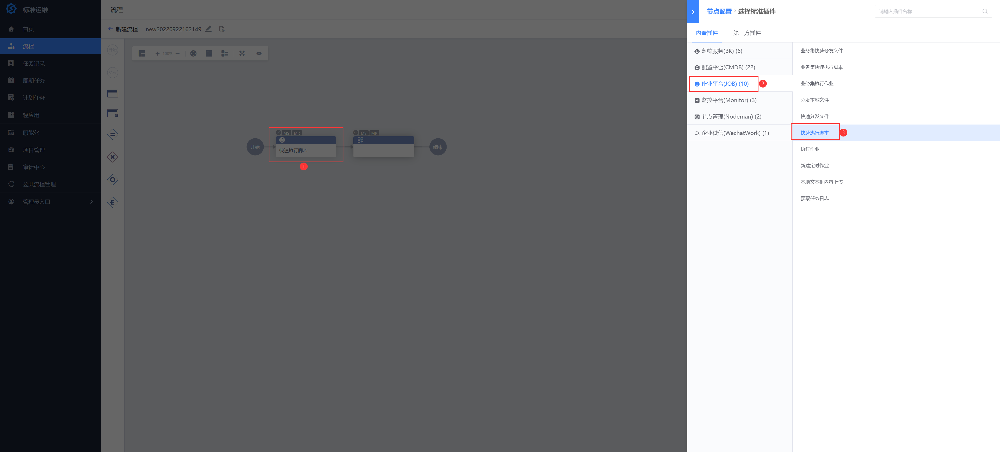

（3）点击`快速执行脚本`节点，页面右侧弹出`节点配置`页面，在其中配置要执行的脚本、服务器 ip、目标账户等信息。填写好参数后，点击`保存`按钮。**该步骤将蓝鲸作业平台的[快速执行脚本]的功能，编排入本流程中。**

（4）点击`发动通知`节点，页面右侧弹出`节点配置`页面，在其中配置通知方式、通知人员、主题、内容等信息。填写好参数后，点击“保存”按钮。**该步骤将蓝鲸 PaaS 平台的`发送通知`的功能，编排入本流程中。**（如果需要真实的发送通知，详见：[如何配置通知渠道，如邮件、微信、短信等？](https://bk.tencent.com/docs/markdown/PaaS平台/产品白皮书/场景案例/noticeWay.md)）

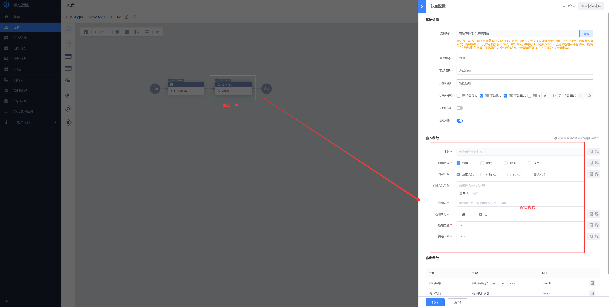

（5）至此，我们就编排好了一个流程，将蓝鲸作业平台【快速执行脚本】和蓝鲸 PaaS 平台【发送消息通知】的两个功能进行串联。现在我们便可以一键式的自动调度执行这个流程。

#### 3、执行流程任务

在项目流程页面，可以查看已经保存的项目流程，通过点击右侧的`新建任务`链接，可以进入该项目流程的执行页面。

（1）第 1 步：查看到这个项目的全部步骤，如果配置了执行方案（步骤的组合），可以选择要执行的执行方案。本例中，我们无须配置，直接点击`下一步`按钮。

（2）第 2 步：选择项目的执行信息和填写流程中需要的参数信息，本例中我们无须配置，直接点击`下一步`按钮。

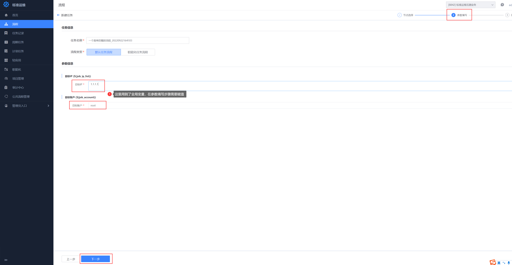

（3）第 3 步：确认节点、参数，无误后，点击右上角的`执行`按钮，基于该流程的一条新任务实例开始执行。

（4）在执行页面，可以直观看到每个节点的执行状态。

（5）点击节点，右侧弹窗会显示该节点详细的输入参数和输出返回的结果。当执行出错时，我们可以依据输入输出参数信息，定位出调用该系统时，执行出错的原因。

（6）节点的调用执行都成功以后，整个任务执行成功。我们可以在【蓝鲸作业平台】上看到服务器脚本的执行记录，也可以收到【蓝鲸 PaaS 平台】发送的邮件通知消息。

这样我们就完成了使用标准运维编排出了多系统调度的自动化流程，并且成功的一键式触发了执行。抛砖引玉，我们可以根据自己的业务场景来编排不同的任务流程。更多标准运维场景使用见：[标准运维产品白皮书](https://bk.tencent.com/docs/markdown/标准运维/产品白皮书/产品简介/README.md)。

### 六、【权限中心】权限管理

> 以管理员（admin）的身份完成了以上的所有相关配置及操作之后，如果公司组织里其他人员需要使用蓝鲸体系产品，该如何进行权限的授权和申请呢？

蓝鲸权限中心（BKIAM）是蓝鲸智云提供的集中权限管理服务，提供权限接入服务，细化到资源实例级别的访问权限控制。用户可以在权限中心通过自定义操作权限、用户组来实现人员权限的管理。    

#### 1、配置权限模板&用户组

蓝鲸部署后，admin 是默认的超级管理员，可以配置权限。

admin 进入到【权限中心】配置**权限模板**及创建**用户组**，比如步骤二里创建的业务`测试专用`，建一个[测试专用业务运维用户组]，该用户组包含了设定的各个系统相关的运维权限，创建好对应的用户组，就可以给用户授权，详细操作见：[权限中心产品白皮书：创建权限模板](https://bk.tencent.com/docs/markdown/权限中心/产品白皮书/快速入门/CreatePremissionTemplates.md)、[创建用户组](https://bk.tencent.com/docs/markdown/权限中心/产品白皮书/快速入门/CreateGroups.md)。

#### 2、admin 可以主动授权或者普通用户申请权限

- 主动授权

  

- 普通用户申请权限（推荐申请用户组，如果不满足可以申请自定义权限）

  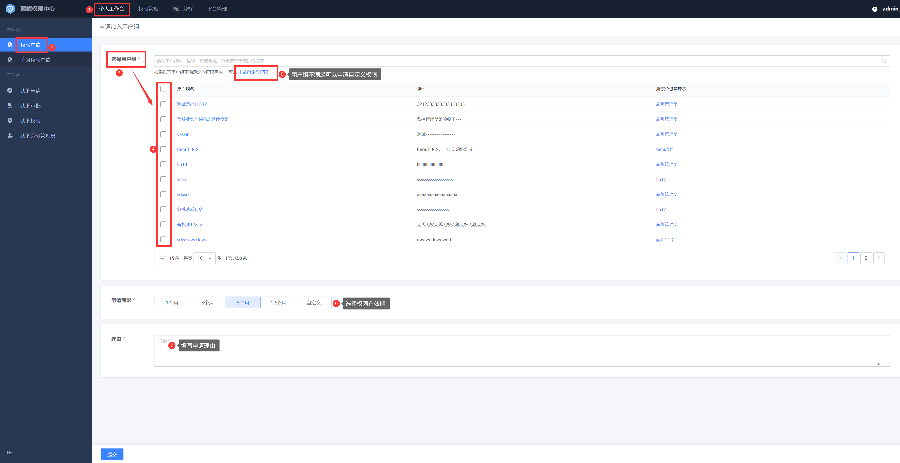

至此，非管理员也具备了使用蓝鲸体系的权限，可以根据具体场景来使用不同的产品。

关于权限管理的更多场景参考：

[如何设置其他管理员？](https://bk.tencent.com/docs/document/6.0/131/7109)

[如何给组织授权？](https://bk.tencent.com/docs/document/6.0/131/8385)

[企业权限管理的最佳实践是怎样的？](https://bk.tencent.com/docs/document/6.0/131/7975)

