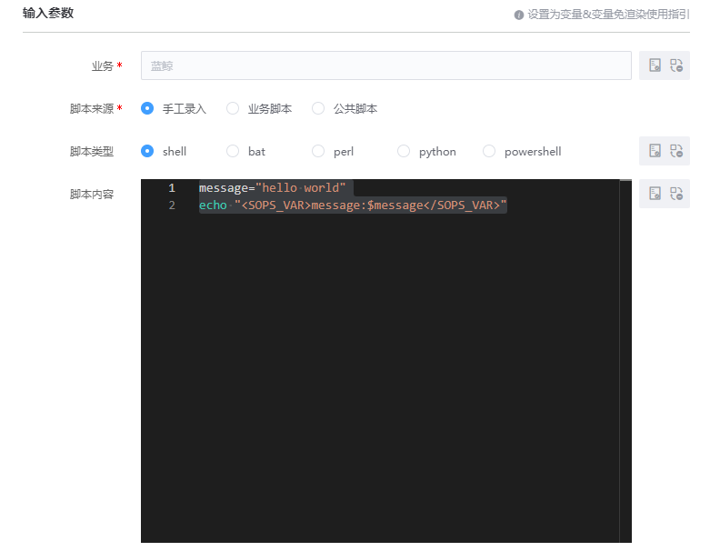

# 如何实现在步骤间传递自定义内容

当我们的流程有多个步骤时，经常需要自定义一些内容，然后传递后面的步骤使用。
这里详细介绍利用作业平台插件配合标准运维的标准运维的标记符号实现此功能

### 1. 使用作业平台(JOB)的插件“快速执行脚本”或“执行作业”

在脚本里使用标准运维的标记符号 ` <SOPS_VAR> </SOPS_VAR>` ，将要传递的数据以 key : value 的形式包含在标记符号中，并使用 echo 、 print 等打印到作业平台(JOB)的日志中

下面示例中，利用 BASH 的 echo 打印了`<SOPS_VAR>message:$message</SOPS_VAR>` ，其中 key 为 message，value 为 “hello world”

```bash
message="hello world"
echo "<SOPS_VAR>message:$message</SOPS_VAR>"
```

标准运维执行到该节点时，会匹配标记符号，提取作业平台(JOB)日志，并存储到标准运维的输出参数 ${log_outputs} 中



### 2. 将输出参数“JOB 全局变量”设置为变量，后续步骤才能使用


### 3. 和访问 dict 类似，使用 $\{log_outputs[key]} 访问自定义的数据


### 4. 一点限制和技巧

```markdown
标记符号为：<SOPS_VAR>key:value</SOPS_VAR>

value 目前暂不支持换行（\n）。如 value 需存储多行数据，可以使用其它符合代替，在后续变量引用中，再使用 python 的替换语法使用。

例 1：
输出为： <SOPS_VAR>message:123|456|789</SOPS_VAR>

引用时用 \n 替换 | ：
${'\n'.join(log_outputs_xxxx['message'].split('|'))}

变量执行时，值为：

123

456

789

例 2：
变量为：<SOPS_VAR>message:1.1.1.1@name1|2.2.2.2@name2|3.3.3.3@name3</SOPS_VAR>

引用时，先用空格替换@，再用换行替换竖线：${'\n'.join(' '.join(log_outputs_xxxx['message'].split('@')).split('|'))}

变量执行时，值为：

1.1.1.1 name1
2.2.2.2 name2
3.3.3.3 name3
```
