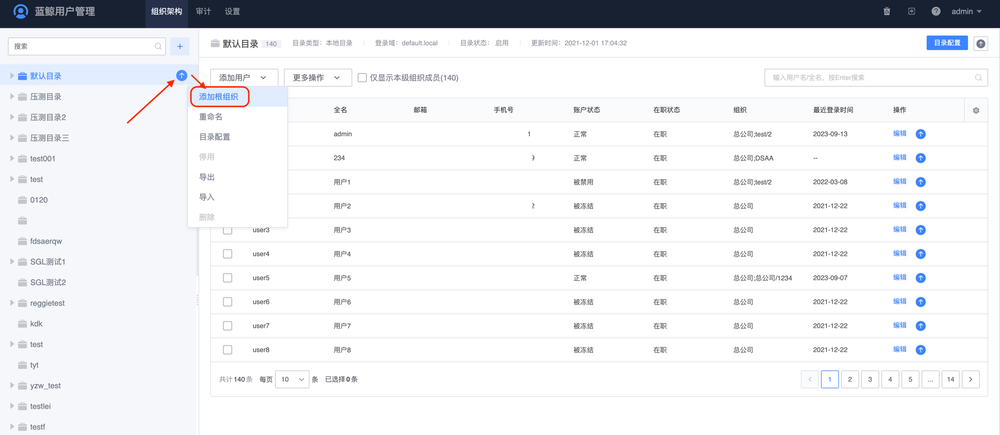
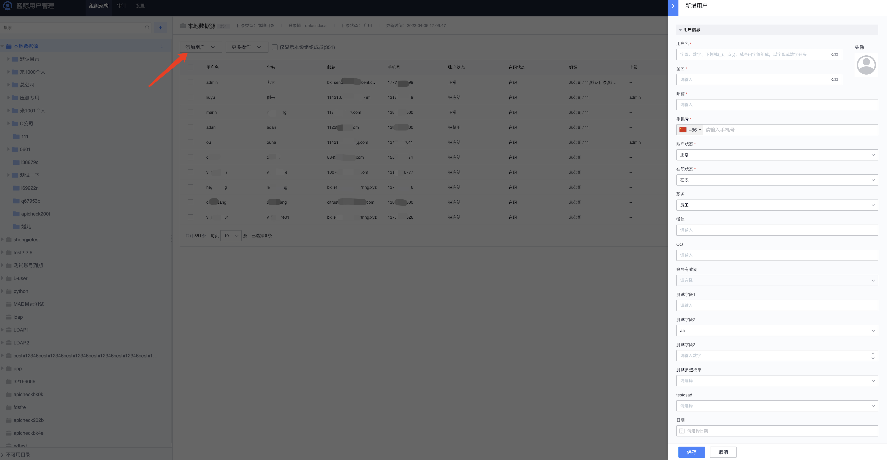

# 如何新增本地用户

本章节介绍如何在`默认目录`下新增本地用户，新增本地用户可以手动创建，也可以通过 Excel 表格批量导入。

## 前置条件

> 需要有默认目录的组织和成员管理权限，或者默认目录的管理权限。

## 手动创建

1. 点击`组织架构菜单`，在组织架构页面下，选择默认目录，点击`添加组织`，输入组织名手动添加根组织，如需创建层级组织，可以在需要的组织右侧点击`添加组织`进行子级组织的创建。

   

2. 选择新创建的组织，在右侧面板，点击`新增用户`进行用户添加。

   - 用户名：用户唯一标识，必填，`由1-32位字母、数字、下划线(_)、点(.)、减号(-)字符组成，以字母或数字开头`
   - 全名：用户`别名`，必填，`全名可随时修改，长度为1-32个字符`
   - 邮箱：用户工作邮箱，必填，`如需使用通过邮件发送随机密码或者用户可以通过忘记密码来找回密码，邮箱必须全局唯一`
   - 手机号：用户手机号，必填
   - 微信：选填
   - QQ：选填
   - 直接上级：用户直属 leader，`在配置审批流程时可以使用该字段`
   - 所在组织：用户所属组织，每个用户必须属于某个组织
   - 账号有效期：默认为永久
   - 密码有效期：用户密码有效期，过了密码有效期，会提示用户修改密码

   

4. 用户登录： 默认用户目录的用户登录时，直接输入用户名即可。

   

## 批量导入

1. 在组织架构页面，选择需要导入用户的`本地用户目录`，点击`导入`按钮。

   

2. 下载导入模板表格。

   

3. 根据模板样例，填写用户信息，`红色字体为必填信息`。

   - 用户名：用户唯一标识，必填，`由1-32位字母、数字、下划线(_)、点(.)、减号(-)字符组成，以字母或数字开头`。
   - 全名：用户`别名`，必填，`全名可随时修改，长度为1-32个字符`。
   - 邮箱：用户工作邮箱，必填，`如需使用通过邮件发送随机密码或者用户可以通过忘记密码来找回密码，邮箱必须全局唯一`。
   - 手机号：用户手机号，必填。
   - 账户状态：默认`正常`。
   - 在职状态：默认`在职`。
   - 组织：请从根组织开始填写（注意不需要填写用户目录）。

   

4. 选择上一步骤编辑好的用户信息表格上传，点击`提交`完成导入，导入成功后，在`组织架构页面`对应的用户目录下可以查看用户人员信息。

   

5. 用户登录： 默认用户目录的用户登录时，直接输入用户名即可。

   

